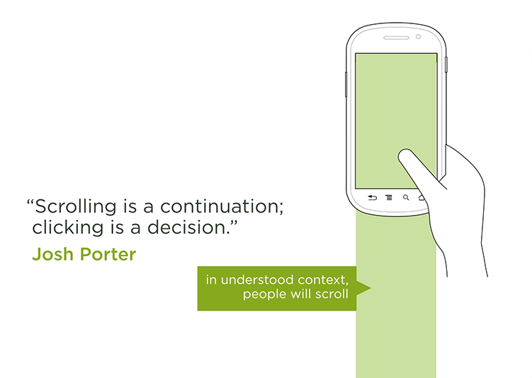

# Design

## Optimal Touch Icon Size

**Touch target size:**
- Recommended: 9mm/34px
   - when accuracy matters = more than 2 gestures or 5s to correct
- Normal: 7mm/26px
   - 1 or 2 guestures or less then 5s to correct
- Minimum: 5mm/19px
   - 1 gesture to correct

**A minimum spacing** between elements of 2mm/8px.

**The visual size** of a UI control to be 60-100% of the touch target size.

## Scrolling vs. Clicking

## Typography

**Modular scales** are a tool, they’re not magic. They’re not going to work for every measurement, and that’s okay. Math is no substitute for an experienced designer’s eye, but it can provide both hints and constraints for decision making. Consider the scale’s numbers educated suggestions. ([A List Apart: More Meaningful Typography](http://alistapart.com/article/more-meaningful-typography))

[4 Simple Steps to Vertical Rhythm](http://typecast.com/blog/4-simple-steps-to-vertical-rhythm)
